# RAG Service Architecture - Full Flowchart

Copy the code block below and paste it in https://mermaid.live to preview.

```mermaid
graph TB
    subgraph CLIENT["🖥️ CLIENT LAYER"]
        USER["👤 User Query"]
        SSE["📡 SSE Stream Client"]
    end

    subgraph API["🌐 API LAYER"]
        CTRL["AiController<br/>/task-manager/chat<br/>/task-manager/chat-stream"]
    end

    subgraph RAG["🧠 RAG SERVICE - Main Orchestrator"]
        direction TB
        CACHE_CHECK{"🔍 Cache Check<br/>generateCacheKey()"}
        CACHE_HIT["⚡ Return Cached<br/>Response"]
        
        subgraph STAGE0["⚡ STAGE 0: QUICK INTENT"]
            QUICK["detectQuickIntent()<br/>Regex + Mini LLM"]
            QUICK_RESP["Quick Response<br/>greeting/goodbye/thank"]
        end
        
        subgraph STAGE1["📋 STAGE 1: PRE-RETRIEVAL"]
            HISTORY["📝 History Management<br/>getHistory()"]
            CLASSIFY["🏷️ Query Classification<br/>classifyQuery()"]
            REFORMULATE["🔄 Query Reformulation<br/>reformulateQuery()"]
            EXTRACT_FILTERS["🎯 Filter Extraction<br/>extractFilters()"]
        end
        
        subgraph ROUTING["🚦 INTENT ROUTING"]
            ROUTE_CHECK{"Intent Type?"}
            ACTION_ROUTE["🔧 ACTION ROUTE<br/>create/update/delete"]
            SPECIAL_ROUTE["🎯 SPECIAL ROUTE<br/>requirements/statistics/help"]
            RAG_ROUTE["🔍 RAG ROUTE<br/>search/question/list/status"]
            SHORTCUT_CHECK{"Simple Query?<br/>isSimpleExactMatch()"}
            SHORTCUT["🚀 Smart Shortcut<br/>Direct Vector Search"]
        end
        
        subgraph STAGE2["🔍 STAGE 2: RETRIEVAL"]
            HYBRID["executeHybridSearch()"]
        end
        
        subgraph STAGE3["⚡ STAGE 3: POST-RETRIEVAL"]
            PROCESS_DOCS["processRetrievedDocs()"]
        end
        
        subgraph STAGE4["✨ STAGE 4: GENERATION"]
            GEN_ANSWER["generateAnswer()"]
            GROUNDING["checkGrounding()"]
            CONFIDENCE["calculateConfidence()"]
            ATTRIBUTION["attributeSources()"]
        end
        
        subgraph STAGE5["💾 STAGE 5: POST-GENERATION"]
            UPDATE_HISTORY["addToHistory()"]
            CACHE_RESULT["Cache Response<br/>5min TTL"]
        end
    end

    subgraph SERVICES["🔧 SUB-SERVICES"]
        subgraph CONV["ConversationService"]
            CONV_GET["getHistory()"]
            CONV_ADD["addToHistory()"]
            CONV_GEN["generateSessionId()"]
        end
        
        subgraph INTENT["IntentClassificationService"]
            INT_QUICK["detectQuickIntent()"]
            INT_CLASS["classifyQuery()"]
            INT_REFORM["reformulateQuery()"]
            INT_FILTER["extractFilters()"]
            INT_TEMPLATES["Response Templates<br/>Greeting/Goodbye/Thank"]
        end
        
        subgraph SEARCH["SearchService"]
            SEARCH_VEC["vectorSearch()"]
            SEARCH_BM25["bm25Search()"]
            SEARCH_RRF["reciprocalRankFusion()"]
            SEARCH_HYBRID["executeHybridSearch()"]
        end
        
        subgraph RETRIEVAL["RetrievalService"]
            RET_RERANK["rerank()"]
            RET_MMR["applyMMR()<br/>Diversity Filtering"]
            RET_COMPRESS["compressContext()"]
            RET_CITE["prepareCitations()"]
            RET_BUILD["buildContext()"]
        end
        
        subgraph GENERATION["GenerationService"]
            GEN_CACHED["cachedLLMCall()"]
            GEN_STREAM["generateAnswerStream()"]
            GEN_CHECK["checkGrounding()"]
            GEN_CONF["calculateConfidence()"]
            GEN_ERROR["formatErrorMessage()"]
        end
        
        subgraph ACTION["ActionExecutionService"]
            ACT_EXEC["executeAction()"]
            ACT_RETRIEVE["retrieveActionContext()"]
            ACT_FUNC["determineFunctionCall()"]
            ACT_RESOLVE["resolveUserId/TeamId/ProjectId()"]
            
            subgraph CRUD["CRUD Operations"]
                CRUD_TASK["Task: create/update/delete"]
                CRUD_USER["User: create/update/delete"]
                CRUD_TEAM["Team: create/update/delete"]
                CRUD_PROJECT["Project: create/update/delete"]
            end
        end
    end

    subgraph INFRA["🏗️ INFRASTRUCTURE LAYER"]
        subgraph EMBEDDING["EmbeddingsService"]
            EMB_GEN["generateEmbedding()"]
            EMB_BATCH["generateBatchEmbeddings()"]
            EMB_PRE["preprocessText()"]
            EMB_VAL["validateEmbedding()"]
            EMB_CACHE["In-Memory Cache<br/>1hr TTL"]
        end
        
        subgraph VECTOR["QdrantService"]
            QD_INIT["initialize()"]
            QD_CREATE["createCollection()"]
            QD_INSERT["insertVector()"]
            QD_SEARCH["searchVectors()"]
            QD_DELETE["deleteVector()"]
            QD_INDEX["Payload Indices<br/>entity_type, dates, relationships"]
        end
        
        subgraph LLM["OllamaService"]
            OL_EMBED["generateEmbedding()<br/>nomic-embed-text"]
            OL_COMP["generateCompletion()<br/>llama3:8b"]
            OL_FAST["Fast Model<br/>llama3.2:3b"]
            OL_OPENAI["OpenAI Fallback<br/>gpt-4.1-nano"]
        end
        
        subgraph INDEXING["IndexingService"]
            IDX_USER["indexUser()"]
            IDX_TEAM["indexTeam()"]
            IDX_PROJECT["indexProject()"]
            IDX_TASK["indexTask()"]
            IDX_DELETE["deleteFromIndex()"]
            IDX_REINDEX["reindexEntity()"]
        end
        
        subgraph TRANSFORM["DocumentTransformerService"]
            TRANS_USER["transformUser()"]
            TRANS_TEAM["transformTeam()"]
            TRANS_PROJECT["transformProject()"]
            TRANS_TASK["transformTask()"]
        end
    end

    subgraph DATA["💾 DATA LAYER"]
        subgraph ENTITIES["Entity Services"]
            ENT_USER["UsersService"]
            ENT_TEAM["TeamsService"]
            ENT_PROJECT["ProjectsService"]
            ENT_TASK["TasksService"]
        end
        
        POSTGRES[("🐘 PostgreSQL<br/>Users, Teams, Projects, Tasks")]
        QDRANT[("🔷 Qdrant Vector DB<br/>task_manager collection<br/>768-dim vectors")]
        REDIS[("🔴 Redis Cache<br/>LLM responses, History, Queries")]
    end

    subgraph RESPONSE["📤 RESPONSE"]
        RESP["ChatResponseDto<br/>answer, sources, confidence,<br/>sessionId, metadata"]
        STREAM_RESP["SSE Events<br/>start→status→sources→chunk→complete"]
    end

    %% Main Flow
    USER --> CTRL
    SSE --> CTRL
    CTRL --> CACHE_CHECK
    CACHE_CHECK -->|Hit| CACHE_HIT
    CACHE_CHECK -->|Miss| QUICK
    CACHE_HIT --> RESP
    
    QUICK -->|Quick Intent| QUICK_RESP
    QUICK_RESP --> UPDATE_HISTORY
    QUICK -->|Not Quick| HISTORY
    
    HISTORY --> CLASSIFY
    CLASSIFY --> ROUTE_CHECK
    
    ROUTE_CHECK -->|create/update/delete| ACTION_ROUTE
    ROUTE_CHECK -->|requirements/statistics/help| SPECIAL_ROUTE
    ROUTE_CHECK -->|search/question/list/status| RAG_ROUTE
    
    ACTION_ROUTE --> ACT_EXEC
    ACT_EXEC --> ACT_RETRIEVE
    ACT_RETRIEVE --> SEARCH_VEC
    ACT_EXEC --> ACT_FUNC
    ACT_FUNC --> GEN_CACHED
    ACT_EXEC --> ACT_RESOLVE
    ACT_RESOLVE --> CRUD
    CRUD --> ENT_USER & ENT_TEAM & ENT_PROJECT & ENT_TASK
    ACT_EXEC --> UPDATE_HISTORY
    
    SPECIAL_ROUTE --> EXTRACT_FILTERS
    RAG_ROUTE --> REFORMULATE
    REFORMULATE --> EXTRACT_FILTERS
    EXTRACT_FILTERS --> SHORTCUT_CHECK
    
    SHORTCUT_CHECK -->|Simple| SHORTCUT
    SHORTCUT --> SEARCH_VEC
    SHORTCUT --> GEN_CACHED
    SHORTCUT --> RESP
    
    SHORTCUT_CHECK -->|Complex| HYBRID
    HYBRID --> SEARCH_VEC & SEARCH_BM25
    SEARCH_VEC --> EMB_GEN
    EMB_GEN --> OL_EMBED
    SEARCH_VEC --> QD_SEARCH
    SEARCH_BM25 --> QD_SEARCH
    SEARCH_VEC & SEARCH_BM25 --> SEARCH_RRF
    
    SEARCH_RRF --> PROCESS_DOCS
    PROCESS_DOCS --> RET_RERANK
    RET_RERANK --> RET_MMR
    RET_MMR --> RET_COMPRESS
    RET_COMPRESS --> RET_CITE
    RET_CITE --> RET_BUILD
    
    RET_BUILD --> GEN_ANSWER
    GEN_ANSWER --> GEN_CACHED
    GEN_CACHED --> OL_COMP
    GEN_ANSWER --> GROUNDING
    GROUNDING --> CONFIDENCE
    CONFIDENCE --> ATTRIBUTION
    
    ATTRIBUTION --> UPDATE_HISTORY
    UPDATE_HISTORY --> CONV_ADD
    CONV_ADD --> REDIS
    UPDATE_HISTORY --> CACHE_RESULT
    CACHE_RESULT --> REDIS
    CACHE_RESULT --> RESP
    
    %% Streaming Flow
    CTRL -->|Stream| GEN_STREAM
    GEN_STREAM --> STREAM_RESP
    
    %% Indexing Flow
    ENT_USER & ENT_TEAM & ENT_PROJECT & ENT_TASK --> POSTGRES
    ENT_USER --> IDX_USER
    ENT_TEAM --> IDX_TEAM
    ENT_PROJECT --> IDX_PROJECT
    ENT_TASK --> IDX_TASK
    
    IDX_USER --> TRANS_USER
    IDX_TEAM --> TRANS_TEAM
    IDX_PROJECT --> TRANS_PROJECT
    IDX_TASK --> TRANS_TASK
    
    TRANS_USER & TRANS_TEAM & TRANS_PROJECT & TRANS_TASK --> EMB_GEN
    EMB_GEN --> EMB_CACHE
    EMB_GEN --> QD_INSERT
    QD_INSERT --> QDRANT

    %% Styling
    classDef primary fill:#4CAF50,stroke:#2E7D32,color:white
    classDef secondary fill:#2196F3,stroke:#1565C0,color:white
    classDef action fill:#FF9800,stroke:#EF6C00,color:white
    classDef storage fill:#9C27B0,stroke:#6A1B9A,color:white
    classDef cache fill:#F44336,stroke:#C62828,color:white
    
    class USER,SSE primary
    class CTRL,RESP,STREAM_RESP secondary
    class ACTION_ROUTE,ACT_EXEC,CRUD action
    class POSTGRES,QDRANT storage
    class REDIS,EMB_CACHE,CACHE_HIT cache
```



---

## 📊 Architecture Summary

### 1. **Entry Points**
- `POST /task-manager/chat` - Standard request/response
- `GET /task-manager/chat-stream` - Server-Sent Events (SSE) streaming

### 2. **5-Stage RAG Pipeline**

| Stage | Purpose | Key Operations |
|-------|---------|----------------|
| **Stage 0** | Quick Intent Detection | Regex + mini LLM for greetings/goodbye/thanks |
| **Stage 1** | Pre-Retrieval | History, Classification, Reformulation, Filter Extraction |
| **Stage 2** | Retrieval | Hybrid Search (Vector + BM25), RRF Fusion |
| **Stage 3** | Post-Retrieval | Reranking, MMR Diversity, Context Compression, Citations |
| **Stage 4** | Generation | Answer Generation, Grounding Check, Confidence Scoring |
| **Stage 5** | Post-Generation | History Update, Cache Storage |

### 3. **Intent Routing**
- **Action Route** → `create/update/delete` → Function Calling → CRUD Operations
- **Special Route** → `requirements/statistics/help` → Targeted Metadata Filtering
- **RAG Route** → `search/question/list/status` → Full RAG Pipeline
- **Smart Shortcut** → Simple exact matches → Direct Vector Search (skip pipeline)

### 4. **Key Services**

| Service | Responsibility |
|---------|----------------|
| `ConversationService` | Session management, history storage (Redis-backed) |
| `IntentClassificationService` | Query classification, reformulation, filter extraction |
| `SearchService` | Hybrid search (vector + BM25), RRF fusion |
| `RetrievalService` | Reranking, MMR, compression, citation preparation |
| `GenerationService` | LLM answer generation, grounding, confidence |
| `ActionExecutionService` | Function calling, CRUD operations, entity resolution |

### 5. **Infrastructure**

| Component | Technology | Purpose |
|-----------|------------|---------|
| **Embeddings** | `nomic-embed-text` (768-dim) | Text → Vector conversion |
| **Vector Store** | Qdrant | Similarity search, payload filtering |
| **LLM** | Ollama (llama3:8b) / OpenAI | Text generation |
| **Fast LLM** | Ollama (llama3.2:3b) | Quick responses |
| **Cache** | Redis | LLM responses, history, query results |
| **Database** | PostgreSQL | Entity storage (Users, Teams, Projects, Tasks) |

### 6. **Caching Strategy**
- **Query Cache**: 5-minute TTL (normalized query hash)
- **LLM Cache**: 10-minute TTL (prompt + model hash)
- **Embedding Cache**: 1-hour TTL (text hash)
- **History Cache**: 30-minute TTL (session-based)

### 7. **Auto-Indexing Flow**
```
Entity CRUD → EntityService → IndexingService → DocumentTransformer → 
EmbeddingsService → QdrantService → Vector DB
```

---

## 🔄 Request Flow Example

**Query**: "Show me all overdue tasks assigned to John"

1. **Cache Check** → Miss
2. **Quick Intent** → Not quick
3. **History** → Fetch session history
4. **Classification** → `type: list, intent: task_management`
5. **Reformulation** → ["Show me all overdue tasks assigned to John", "tasks related to: overdue John"]
6. **Filter Extraction** → `{entity_type: 'task', 'metadata.is_overdue': true}`
7. **Hybrid Search** → Vector + BM25 parallel search
8. **RRF Fusion** → Merge and rank results
9. **Post-Retrieval** → Rerank → MMR → Compress → Cite
10. **Generation** → LLM generates answer with citations
11. **Grounding** → Verify answer is grounded in sources
12. **Confidence** → Calculate score (avg doc score + grounding bonus)
13. **History Update** → Store user query + assistant response
14. **Cache** → Store result for 5 minutes
15. **Response** → Return `ChatResponseDto`
